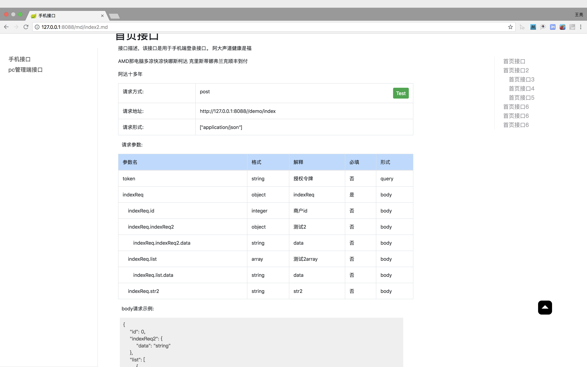

# markdown-swagger-ui


> markdown形式的swagger-ui接口文档


## 使用说明

 该框架是基于swagger-ui 2.8.0 界面扩展

* 将swagger-ui 2.8.0的jar用如下maven配置替换

``` 
 <dependency>
     <groupId>com.codingapi.swagger</groupId>
     <artifactId>swagger-ui</artifactId>
     <version>2.8.0</version>
 </dependency>
 
```

* 在项目的resources下添加static/md文件夹下，然后添加接口文档的md文件

```
.
└── static
    ├── img
    │   └── logo.png
    └── md
        ├── index.md
        └── index2.md

```


* markdown文档格式如下

```

# Demo项目演示文档

## 首页接口

接口描述，该接口是用于手机端登录接口。

<api mapping="/demo/index" method="post"></api>


### 首页接口2

我是接口说明2。 

<api mapping="/demo/index2" method="post"></api>


```

支持## ### 交替索引的目录

关于api标签说明:

mapping 对应项目中controller的mapping全路径
method  对应请求方式   

编写文档的时候可以用markdown格式写清楚接口定义


* 接口文档访问路径

http://ip:port/md/xxx.md   

例如：
http://127.0.01:8080/md/index.md


## 效果



## 关于Test(接口测试)

点击Test的时候会跳转到swagger2.8.0官网文档界面，然后会自动打开对应接口的调试界面。

## 示例项目

https://github.com/1991wangliang/demo-test


## QA

Q：当访问界面时遇到如下错误


```
Whitelabel Error Page This application has no explicit mapping for /error, so you are seeing this as a fallback.

Wed Sep 19 20:15:01 CST 2018 There was an unexpected error (type=Internal Server Error, status=500). Exception parsing document: template="markdown", line 461 - column 43
```

A: 在项目的pom文件的properties下添加如下配置

```
<thymeleaf.version>3.0.9.RELEASE</thymeleaf.version>
<thymeleaf-layout-dialect.version>2.0.4</thymeleaf-layout-dialect.version>
```


