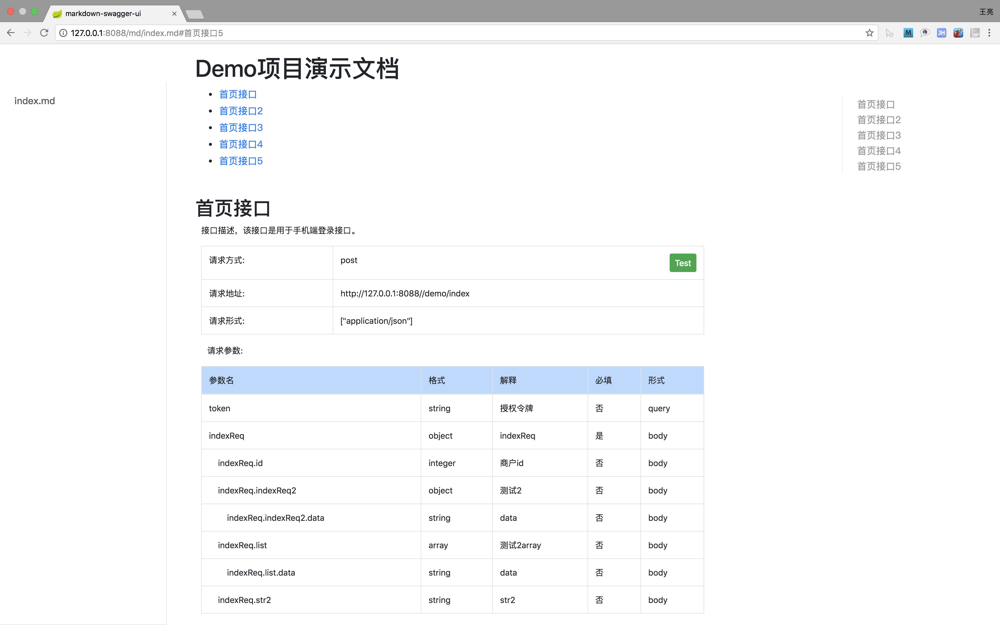

# swaggerui


调整swaggerui，支持markdown方式对接口的描述。基于swagger-ui 2.8.0版本


## 使用说明

* 将swagger-ui 2.8.0的jar用该maven替换

``` 
 <dependency>
     <groupId>com.codingapi.swagger</groupId>
     <artifactId>swagger-ui</artifactId>
     <version>2.8.0</version>
 </dependency>
 
```

* 在项目的resources下添加static/md文件夹下，然后添加接口文档的md文件


* 接口文档访问路径


http://ip:port/md/xxx.md文件  

例如上图的文件则访问地址为

http://ip:port/md/index.md


* markdown文档格式如下

```

# Demo项目演示文档

## 首页接口

接口描述，该接口是用于手机端登录接口。 

<api name="/demo/index" type="post"></api>


## 首页接口2

我是接口说明2。 

<api name="/demo/index2" type="post"></api>


```

关于api标签说明  

api标准中name对应项目中controller的mapping  
type对应请求方式   


编写文档的时候可以用markdown格式写清楚接口定义


## 效果



## 关于测试

点击调试的时候会跳转到swagger访问的文档界面，然后自动打开对该接口的调试。


